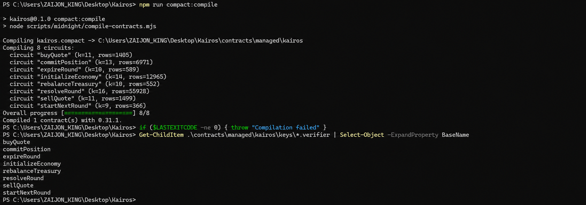
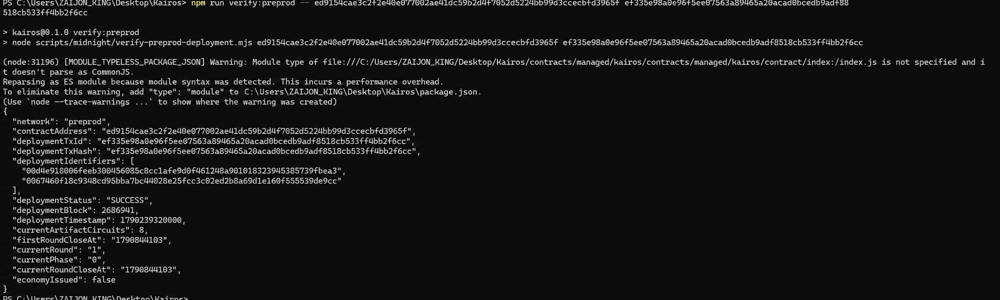
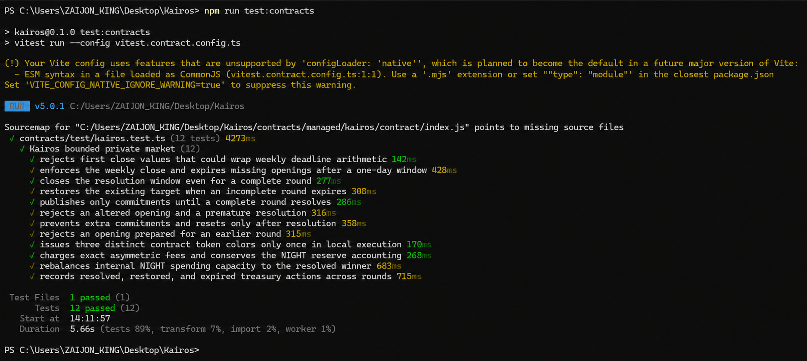

# Kairos

**Private market conviction, public treasury rules, on Midnight Preprod.** Kairos is a quote-side signal market and contract-custodied trading prototype. Participants commit to a side without publishing it; a trusted resolver later proves the complete eight-position tally. The result sets a public treasury reserve target. Quote trades and treasury accounting are public.

## Quick links and current status

Evidence checked on **25 September 2026** against public `main` commit `f47d891`. A public page or a compiled circuit is not, by itself, evidence of a finalized user transaction.

| Item                        | Link or observation                                                                                                                                                                                                                                                              |
| --------------------------- | -------------------------------------------------------------------------------------------------------------------------------------------------------------------------------------------------------------------------------------------------------------------------------- |
| Public source               | [GitHub repository](https://github.com/zaejohn/kairos-dapp) · [commit history](https://github.com/zaejohn/kairos-dapp/commits/main)                                                                                                                                              |
| Public demo                 | [kairos-dapp.vercel.app](https://kairos-dapp.vercel.app) — homepage, health route, robots file, sitemap, and one proving asset returned successfully without sign-in. Wallet transactions have not been independently verified on this origin.                                   |
| Midnight network            | **Preprod only**                                                                                                                                                                                                                                                                 |
| Contract address            | `ed9154cae3c2f2e40e077002ae41dc59b2d4f7052d5224bb99d3ccecbfd3965f`                                                                                                                                                                                                               |
| Deployment transaction hash | `ef335e98a0e96f5ee07563a89465a20acad0bcedb9adf8518cb533ff4bb2f6cc`                                                                                                                                                                                                               |
| Deployment verification     | Read-only [verifier](scripts/midnight/verify-preprod-deployment.mjs) returned `SUCCESS` in block **2,686,941** and matched all **eight** deployed verifier keys to this build. [Recheck it](#verify-the-contract-and-submission-evidence).                                       |
| CI                          | [Latest `main` run](https://github.com/zaejohn/kairos-dapp/actions/runs/36095923026): quality job passed; browser-test job failed. An [earlier full run](https://github.com/zaejohn/kairos-dapp/actions/runs/36007235585) passed on `6359b53`. **Current-head CI is not green.** |
| Git history                 | **49 commits** on public `main` at the audited commit. [Examples of substantive milestones](#commit-history). Determine whether commits are meaningful.                                                                                                                          |

## Initial product idea

Kairos lets participants express a private weekly view on one of two quote sides. The Compact contract accepts eight salted commitments, verifies their openings in a later resolution proof, publishes the winning side, and applies a transparent 70/30 target to internal NIGHT redemption reserves. This is a bounded signal and accounting system: someone must submit the resolution transaction, a trusted resolver sees the openings, and external liquidity execution is not implemented.

## Product and user flow

1. A participant connects a compatible wallet on Preprod, chooses Quote A or B, downloads a private opening file, and submits its commitment before the public close time.
2. A trusted resolver receives **all eight** opening files privately. After close, the resolution circuit verifies each opening against its indexed public commitment and publishes the winner. A tie keeps the previous target. A missed round can expire after the resolution window.
3. Resolution or expiry applies the target to **internal** NIGHT redemption reserves. A separate call can restore the target after later trades; the next round starts only when the reserve split matches its target.
4. A one-time issuance circuit and public NIGHT/quote buy and sell circuits implement the contract-custodied token economy, fees, and bounded KAI trade incentive. Treasury actions append public accounting records.

The contract has compiled and local accounting/proving checks have passed. **No commitment, resolution, issuance, trade, or reserve action after this deployment has been independently verified on Preprod.** The contract's current public state reported `economyIssued: false` at this audit. These economic routes do not provide an external exchange, guaranteed redemption when a side reserve is empty, staking yield, or a token-wide transfer tax. See [usage](docs/USAGE.md) and [capability boundaries](docs/research/PRODUCT_CAPABILITIES.md).

## Privacy model: public state vs private witness

| Data                                                                  | Who can learn it?                                            | What the circuit establishes                                                                            |
| --------------------------------------------------------------------- | ------------------------------------------------------------ | ------------------------------------------------------------------------------------------------------- |
| Round time and phase; indexed commitment hashes and count             | Anyone reading the public ledger                             | A commitment is recorded before close.                                                                  |
| Individual side and random salt                                       | Participant; later the trusted resolver and its proof server | The commitment circuit uses them without writing them as public state.                                  |
| All eight openings                                                    | Trusted resolver and its proof server during resolution      | The resolution proof checks each opening against its public indexed commitment and computes the winner. |
| Winner, target, reserves, fees, token colors, treasury-action history | Anyone reading public state                                  | The contract applies its public accounting rules.                                                       |
| Trade side, amount, fee, and unshielded recipient                     | Anyone reading the public transaction                        | Trades are **not** private.                                                                             |

An on-chain observer can see a commitment's hash, index, and transaction timing, but cannot read its side or salt from the public ledger. Resolution publishes the winner, not the eight individual sides. This is **ledger privacy**, not anonymity: the resolver, its proof server, the participant's wallet/device, and someone who receives an opening can learn more. A small cohort and timing can permit inference. Commitments do not prove eight distinct people; one wallet can submit several. Never post an opening file, local storage password, or wallet secret as submission evidence. See [the full privacy model](docs/product/PRIVACY_MODEL.md).

## Run locally

### Prerequisites

- Node.js **22.22 or newer in the 22.x line**, npm, Docker, and Compact devtools **0.5.1** with compiler **0.31.1**. Follow the [Midnight installation guide](https://docs.midnight.network/getting-started/installation). On Windows, install and run Compact through **WSL Ubuntu**; Windows' `compact.exe` is unrelated.
- For read-only viewing, a wallet and proof server are not needed. For transactions, use Midnight Lace on **Preprod**, with DUST; public quote trades also need the required unshielded input asset.
- Each transaction user's machine needs Kairos' local proof server **8.1.0** at `127.0.0.1:6301`. Lace separately uses a trusted local proof server at `localhost:6300`. A hosted Vercel page does **not** provide either user's localhost service.

### Install and start

1. Clone the [repository](https://github.com/zaejohn/kairos-dapp), copy `.env.example` to `.env.local`, and keep `NEXT_PUBLIC_MIDNIGHT_NETWORK=preprod` and the supplied verified contract address. In PowerShell: `Copy-Item .env.example .env.local`. In Bash: `cp .env.example .env.local`.
2. From the repository root, run:

   ```sh
   npm ci
   npm run compact:compile
   npm run proof:up
   npm run proof:status
   npm run dev
   ```

3. Open `http://localhost:3000`. Select **Enter the Garage**, then use the workshop stations or the tablet/mobile navigation. The configured contract loads automatically; regular users do not deploy or type a contract address.
4. For Lace transactions, also start/configure Lace's **separate** trusted proof service on port 6300 as described in the [Vercel and local proof guide](docs/DEPLOY_VERCEL.md). In **Settings**, enter a strong local storage password, select **Save password**, confirm it is saved for this browser session, and select **Check local proof server**. Grant the browser's Local Network Access prompt if it appears. The password protects local Midnight signing-key storage; it is not a recovery phrase.

`npm run compact:compile` generates `contracts/managed/kairos` (contract code, circuits, and keys) and `public/zk/kairos` (browser proving assets). Both directories are **generated and Git-ignored**, so they are present after compilation locally and in the build, not in a fresh Git checkout. If the challenge requires `managed/` to be committed rather than generated during judging, this repository does not currently meet that literal interpretation.

### Configuration

| Variable                              | Local / production use                                                                                |
| ------------------------------------- | ----------------------------------------------------------------------------------------------------- |
| `NEXT_PUBLIC_MIDNIGHT_NETWORK`        | Must be `preprod`.                                                                                    |
| `NEXT_PUBLIC_KAIROS_CONTRACT_ADDRESS` | The verified public 64-hex contract address above.                                                    |
| `KAIROS_DEPLOYMENT_TX_ID`             | The public deployment hash above, required by the production build verifier.                          |
| `KAIROS_SITE_URL`                     | Canonical HTTPS production origin for metadata and sitemap; set in Vercel, not for local development. |
| `MIDNIGHT_PROOF_SERVER_URL`           | Local developer scripts only; default `http://127.0.0.1:6301`.                                        |

No API key, database credential, or server-held wallet secret is required. The production Vercel settings, domain/protection choices, and public-route checks are documented in [DEPLOY_VERCEL.md](docs/DEPLOY_VERCEL.md). Only local development builds expose **Local developer controls** for replacement deployment; the public site uses its configured contract.

## Verify the contract and submission evidence

### Compile, generated files, and tests

Run `npm run compact:compile` and inspect the output and `contracts/managed/kairos/keys`. The expected eight circuits are `initializeEconomy`, `buyQuote`, `sellQuote`, `commitPosition`, `resolveRound`, `expireRound`, `rebalanceTreasury`, and `startNextRound`. Each has generated prover/verifier material. Then run:

```sh
npm run verify
npx playwright install chromium
npm run test:e2e
```

`npm run verify` compiles, runs contract and application tests, lint and typecheck, and builds the app. Its steps passed in the [current-head quality job](https://github.com/zaejohn/kairos-dapp/actions/runs/36095923026/job/107948065182). The **full current-head CI run fails** in `test:e2e`: eight browser cases look for the workshop immediately, while the homepage now begins with an **Enter the Garage** intro. The [CI workflow](.github/workflows/ci.yml) and [failing browser job](https://github.com/zaejohn/kairos-dapp/actions/runs/36095923026/job/107948435271) make this visible. Fix and rerun the browser flow before presenting a green badge or claiming current-head CI passes. No test-output screenshot is checked into the repository.

The local `npm run proof:smoke` command checks/proves eight circuits with synthetic inputs against the local proof server. It is **not** evidence of wallet authorization or a Preprod transaction.

### Verify the finalized deployment

With generated artifacts present, run this **read-only** command:

```sh
npm run verify:preprod -- ed9154cae3c2f2e40e077002ae41dc59b2d4f7052d5224bb99d3ccecbfd3965f ef335e98a0e96f5ee07563a89465a20acad0bcedb9adf8518cb533ff4bb2f6cc
```

It queries the [Midnight Preprod indexer](https://indexer.preprod.midnight.network/api/v4/graphql), checks that the transaction deployed this exact address with final `SUCCESS`, and compares all eight deployed verifier keys with the local build. At this audit it returned block **2,686,941**, round **1**, phase **0**, and `economyIssued: false`. Current round and economy fields can change after future transactions.

### Verify an actual frontend circuit call

1. On the [public demo](https://kairos-dapp.vercel.app) in the browser profile with Preprod Lace, select **Enter the Garage**, then **Wallet** and connect Lace. In **Settings**, enter and **save** the local storage password, then confirm the local proof server. The wallet should show Preprod and the connected addresses/balance.
2. Open **Trading Engine** before the round close. Choose a side, prepare and download its opening file, acknowledge that it is saved, then submit the commitment and approve the wallet request. Keep the opening private.
3. Wait for a **finalized** receipt. Record its public transaction hash or identifier and refresh public state. A pending or merely submitted transaction is insufficient.
4. From the repository root, run:

   ```sh
   npm run verify:activity -- ed9154cae3c2f2e40e077002ae41dc59b2d4f7052d5224bb99d3ccecbfd3965f <finalized-transaction-hash-or-identifier> commitPosition
   ```

   Replace the angle-bracket placeholder with the **circuit call's** finalized ID, not the deployment hash. The command must report a successful `commitPosition` call to this contract. Check that the public commitment count increased and that the ledger does not publish the opening's side/salt. This verifies one circuit call, **not** a distinct person.

5. To demonstrate a complete round, obtain eight openings in public index order through a private channel, resolve within the one-day window after close, and verify the `resolveRound` transaction and new public target. For the economic extension, verify `initializeEconomy`, `buyQuote`/`sellQuote`, and `rebalanceTreasury` **separately** with their own finalized receipts and public-state changes. See [the detailed usage guide](docs/USAGE.md).

No post-deployment circuit receipt is currently recorded here. Do not label the frontend circuit, resolution, issuance, or trade as live-verified until the steps above succeed.

## Level-by-level submission checklist

The statuses below apply to this evidence snapshot. **Implemented** means code or local checks exist; **verified** means the linked public/local evidence supports the narrower claim. No whole level is marked complete while a required item is pending.

### Level 1

| Requirement                                                                | Evidence / status                                                                                                                                                                                                                                                                                                  |
| -------------------------------------------------------------------------- | ------------------------------------------------------------------------------------------------------------------------------------------------------------------------------------------------------------------------------------------------------------------------------------------------------------------ |
| Public repository, README, setup, initial idea, public/private explanation | [Public repository](https://github.com/zaejohn/kairos-dapp); sections above. **Verified.**                                                                                                                                                                                                                         |
| Toolchain, Compact compile, passing tests                                  | Pinned toolchain, [compile screenshot](docs/evidence/compact-compile.png), [12 passing contract tests](docs/evidence/contract-tests.png), and [current-head quality job](https://github.com/zaejohn/kairos-dapp/actions/runs/36095923026/job/107948065182). **Local screenshots captured; CI quality job passed.** |
| Generated `managed/` circuits and keys                                     | Created by `npm run compact:compile`; present locally, **ignored in Git**. Must run the command; confirm organizer expectations if they require the directory in Git.                                                                                                                                              |
| Preview/Preprod deployment and visible address                             | Preprod address/hash above; read-only verifier returned `SUCCESS` and eight matching keys. [Deployment screenshot](docs/evidence/preprod-deployment.png) shows the address and `SUCCESS`. **Verified.**                                                                                                            |
| At least 5 meaningful commits                                              | 49 total commits at audited `main`; [milestone examples](#commit-history). **Count verified; meaning is judge-assessed.**                                                                                                                                                                                          |

**Compile evidence:** Compact compiler 0.31.1 completed one contract, listed all eight circuits, and generated their verifier keys.



**Deployment evidence:** The read-only Preprod verifier reports the deployed address, transaction hash, `SUCCESS` in block 2,686,941, and eight current artifact circuits.



### Level 2

| Requirement                                                      | Evidence / status                                                                                                                                                                                                |
| ---------------------------------------------------------------- | ---------------------------------------------------------------------------------------------------------------------------------------------------------------------------------------------------------------- |
| Lace connect/disconnect                                          | [Wallet implementation](src/lib/midnight/wallet.ts) and [frontend](src/components/kairos-app.tsx) exist; owner reported successful connection. **Live approval/disconnect evidence for judges is still needed.** |
| Successful frontend circuit call and observable privacy behavior | Commitment/resolution circuits and local tests exist; public witness boundary is explained above. **No finalized post-deployment circuit call verified.**                                                        |
| Preprod contract, public demo, privacy claim                     | Verified deployment above; [public demo](https://kairos-dapp.vercel.app) loads without sign-in; privacy section above. **Read-only demo verified; transaction flow pending.**                                    |
| At least 8 meaningful commits                                    | 49 total; [history](#commit-history). **Count verified; meaning is judge-assessed.**                                                                                                                             |

### Level 3

| Requirement                                                      | Evidence / status                                                                                                                                                                                                                                                                                   |
| ---------------------------------------------------------------- | --------------------------------------------------------------------------------------------------------------------------------------------------------------------------------------------------------------------------------------------------------------------------------------------------- |
| Functional privacy dApp, at least 3 passing tests                | Eight-circuit app, [test screenshot](docs/evidence/contract-tests.png) showing **12 passing contract tests**, and [current-head quality job](https://github.com/zaejohn/kairos-dapp/actions/runs/36095923026/job/107948065182). **Local/CI test evidence exists; live circuit remains unverified.** |
| CI workflow with passing runs                                    | [Workflow](.github/workflows/ci.yml) and [earlier full green run](https://github.com/zaejohn/kairos-dapp/actions/runs/36007235585) exist. **Latest `main` run is red**, so current-head passing CI is pending.                                                                                      |
| Approved idea from provided list / submitted product proposal    | [PROPOSAL.md](PROPOSAL.md) still has owner placeholders. Kairos has **no recorded category approval or exception** from the organizer. **Pending.**                                                                                                                                                 |
| Public README/demo/privacy explanation and 10 meaningful commits | Links/sections above; 49 total commits. **Documented; judge assesses meaning and live functionality.**                                                                                                                                                                                              |

**Test evidence:** The local Vitest contract suite completed with 12 passing tests in one test file. This screenshot is test evidence, not a live Preprod circuit receipt.



### Level 4

| Requirement                                 | Evidence / status                                                                                                                                        |
| ------------------------------------------- | -------------------------------------------------------------------------------------------------------------------------------------------------------- |
| Level 3 eligibility and working Preprod MVP | Public app and deployed contract are verified, but a real circuit/economic transaction is not. **Pending complete live MVP evidence and idea approval.** |
| Full documentation, live link, CI           | This README, [usage](docs/USAGE.md), [Vercel guide](docs/DEPLOY_VERCEL.md), and public demo exist. **Current-head CI remains red.**                      |
| Product X profile                           | No verified product profile URL is recorded. **Pending owner setup and link.**                                                                           |
| At least 15 meaningful commits              | 49 total; [history](#commit-history). **Count verified; meaning is judge-assessed.**                                                                     |

### Level 5

| Requirement                         | Evidence / status                                                                                                                                                                         |
| ----------------------------------- | ----------------------------------------------------------------------------------------------------------------------------------------------------------------------------------------- |
| Same Level 4 MVP, extended          | Token economy, trading, reserve restoration, and treasury history are implemented and locally checked; their live Preprod calls are **unverified**. Level 4 prerequisites remain pending. |
| Updated documentation and live demo | This README and [public demo](https://kairos-dapp.vercel.app) exist; live transaction proof remains pending.                                                                              |
| At least 20 meaningful commits      | 49 total; [history](#commit-history). **Count verified; meaning is judge-assessed.**                                                                                                      |

The repository's [longer challenge brief](docs/challenge/LEVELS_1_5.md) also asks for demo videos and Level 5 user/feedback validation. [USERS.md](USERS.md) records **0/50 verified wallet interactions** and [docs/FEEDBACK.md](docs/FEEDBACK.md) records no feedback; neither should be inferred from a wallet address or the public website.

## Commit history

The public `main` branch had **49 commits** at `f47d891`. Examples that a judge can inspect: [Compact contract](https://github.com/zaejohn/kairos-dapp/commit/7f5aee6), [contract tests](https://github.com/zaejohn/kairos-dapp/commit/db65b55), [wallet integration](https://github.com/zaejohn/kairos-dapp/commit/5e47e8c), [CI pipeline](https://github.com/zaejohn/kairos-dapp/commit/bff003e), [private signal market](https://github.com/zaejohn/kairos-dapp/commit/7315e2c), [quote economy](https://github.com/zaejohn/kairos-dapp/commit/905e685), and [Preprod deployment verification](https://github.com/zaejohn/kairos-dapp/commit/03e005b). The total includes scaffolding and maintenance commits; the challenge's **meaningful** threshold is a human review, not an automatic count.

## Remaining work before submission

1. **Repair current-head CI.** The [latest browser job](https://github.com/zaejohn/kairos-dapp/actions/runs/36095923026/job/107948435271) fails because the app now opens with **Enter the Garage** while the Playwright flow looks for workshop controls immediately. Update the browser tests for the actual entry flow, run `npm run test:e2e`, push the fix, and confirm the newest `main` **quality and e2e jobs both pass**. Only then add a green current-head CI badge.
2. **Publish the captured screenshots.** The compile, deployment, and 12-test images are embedded under Levels 1 and 3 above. Commit `README.md` and all three files in `docs/evidence/`, push them, and open the public README in a signed-out browser to confirm that each image renders. Keep passwords, opening files, and wallet secrets out of future evidence.
3. **Prove a real frontend circuit call and record the demo.** Follow [the live verification steps above](#verify-an-actual-frontend-circuit-call) in a funded Preprod Lace browser with both local proof services. Save the finalized public transaction ID, run `verify:activity` against `commitPosition`, and add the result link/receipt to the README. Record a short video showing Lace connection, finalized circuit result, and disconnection; the repository's longer Level 2–3 checklist calls for a demo video. Keep the opening private.
4. **Finish and submit the proposal.** Replace the placeholders in [PROPOSAL.md](PROPOSAL.md), select a category from the challenge's provided idea list **or obtain an explicit exception for Kairos**, submit it through the organizer's actual channel, and record the approval evidence. This repository contains no approval.
5. **Link the product X profile.** Create or identify the official Kairos profile, publish only claims supported by the live evidence, and add its exact URL here. There is no verified URL to use today.
6. **For Level 5's longer brief, gather real user evidence.** Obtain consent, verify each finalized Kairos Preprod interaction and wallet control, avoid counting repeat addresses as distinct wallets or people, and update [USERS.md](USERS.md) and [docs/FEEDBACK.md](docs/FEEDBACK.md) with genuine feedback and linked improvements. Current verified count is zero.
7. **Publish this README update.** Review the screenshots and links, commit the documentation, push it to the public repository, and re-open the public README and demo in a signed-out browser. Until then, judges see the older README on GitHub.

For deployment changes or a replacement contract, follow [DEPLOY_VERCEL.md](docs/DEPLOY_VERCEL.md); do not substitute a new address without its matching finalized deployment and verifier keys.
